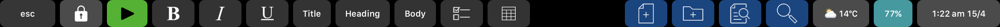

# touch-bar
Custom Mac Pro touch bar settings

- [Install instructions](https://github.com/gromitski/touch-bar#install-instructions)
- [Global tools](https://github.com/gromitski/touch-bar#global-functions)
- [Standard tools](https://github.com/gromitski/touch-bar#standard-tools)
- [CTRL triggered tools](https://github.com/gromitski/touch-bar#ctrl-triggered-tools)
- [Google Chrome specific](https://github.com/gromitski/touch-bar#google-chrome-specific)
- [Terminal specific](https://github.com/gromitski/touch-bar#terminal-specific)
- [Spotify specific](https://github.com/gromitski/touch-bar#spotify-specific)
- [Apple Notes specific](https://github.com/gromitski/touch-bar#apple-notes-specific)
- [Credits](https://github.com/gromitski/touch-bar#credits)

## Install instructions
These tools have been set up using a combination of applescript and the software [Better Touch Tool](https://folivora.ai/). To install them simply download and install the software, then click "Manage Presets" followed by "Import".

## Global tools

These tools/gestures are available on all toolbars except when CTRL is held down.

_Standard touch bar_

_Standard touch bar with Spotify playing_

_Standard touch bar with Spotify playing and a reminder_

_Standard touch bar with a reminder_

**left aligned**
- lock screen
- spotify play/pause

**right aligned**
- date/time (pressing btn starts screen capture)
- battery % (pressing btn mutes)
- today's weather (pressing btn empties trash)

**hidden (gestures)**
- 2 finger swipe left (volume down)
- 2 finger swipe right (volume up)
- 3 finger swipe left (brightness down)
- 3 finger swipe right (brightness up)

**hidden (display when needed)**
- display what's playing on YouTube
- display what's playing on Spotify
- display reminders

## CTRL triggered tools

This is an alternative toolbar, triggered by pressing CTRL at any time

**left aligned**
- align window left
- align window right
- align window top
- align window bottom
- align window
- restore window dimensions

**right aligned**
- colour picker

## Google Chrome Specific

Toolbar appears when Google Chrome is in focus

_Google Chrome specific touch bar_

**left aligned**
- new page
- new incognito page
- new tab
- open closed tab
- nav to previous tab
- nav to next tab
- hard refresh
- open/close dev tools
- javascript console

## Terminal Specific

Toolbar appears when Terminal is in focus

_Terminal specific touch bar_

**left aligned**
- clear screen
- start of line
- back one word
- back one character
- fwd one character
- fwd one word
- end of line

**right aligned**
- home (cd ~/)
- docs (cd ~/Documents/)
- previous tab
- new tab
- next tab

## Spotify Specific

Toolbar appears when Spotify is in focus

_Spotify specific touch bar_

_Spotify specific touch bar with music playing_

**left aligned**
- previous track
- play/pause (part of the Global tool set)
- next track
- display track (part of the Global tool set)
- search spotify

**right aligned**
- mute

## Apple Notes Specific

Toolbar appears when Notes is in focus. 

_Apple Notes specific touch bar_

**left aligned**
- bold
- italics
- underline
- title
- heading
- body
- checklist
- table

**right aligned**
- new note
- new folder
- find in note
- note search

## Credits

**Icons**

Whenever possible, all icons are taken from the default BetterTouchTool icon sets. Occasionally however additional icons were needed. Additional icons are sourced from [The Noun Project](https://thenounproject.com). Icon credits to: Momento Design, Creaticca Creative Agency & Lloyd Humphreys.

**Code snippets**

Code snippets are all custom written or bespoke built in BetterTouchTool. A couple of scripts though were borrowed from [this article by Vasily Zuberev](https://vas3k.com/blog/touchbar/). Thanks Vasily for inspiring me to create these custom touch tools.

